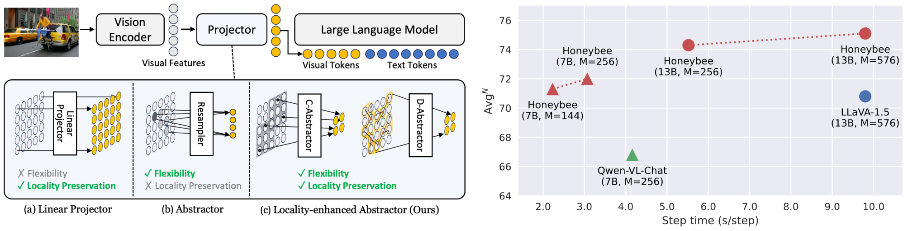
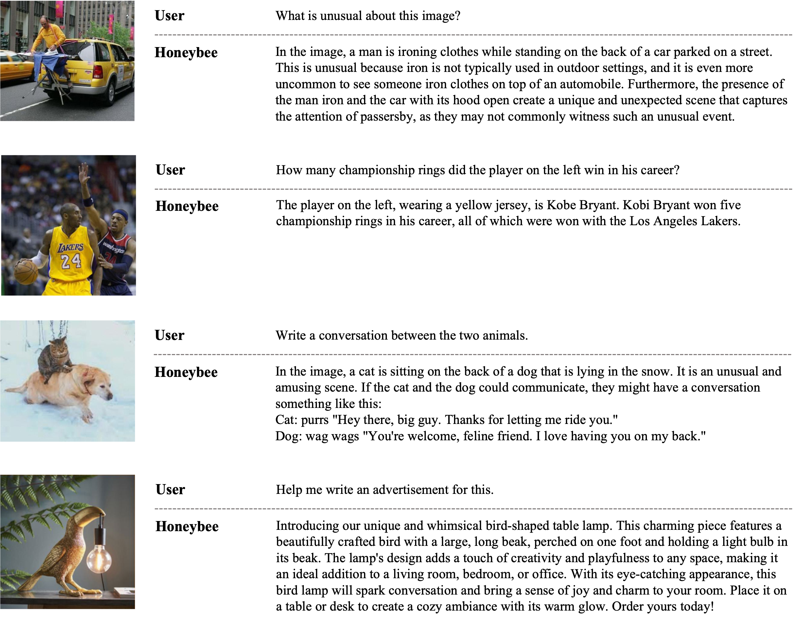

[](http://kakaobrain.com/)

# 🐝 Honeybee: Locality-enhanced Projector for Multimodal LLM

This is an official PyTorch Implementation of [**Honeybee: Locality-enhanced Projector for Multimodal LLM**](https://arxiv.org/abs/2312.06742), *Junbum Cha<sup>\*</sup>, Wooyoung Kang<sup>\*</sup>, Jonghwan Mun<sup>\*</sup>, Byungseok Roh*. [[paper](https://arxiv.org/abs/2312.06742)]


<p align="center"></p>

## Catalog

**Coming soon:**
- [x] Arxiv
- [x] Inference code
- [x] Checkpoints
- [ ] Training code


## Selected Examples
<p align="center"></p>

## Environment

- PyTorch `2.0.1`

```bash
pip install -r requirements.txt

# additional requirements for demo
pip install -r requirements_demo.txt
```

## Model Zoo
We use [MMB](http://arxiv.org/abs/2307.06281), [MME](https://arxiv.org/abs/2306.13394), [SEED-Bench](https://arxiv.org/abs/2307.16125), and [LLaVA-Bench (in-the-wild)](https://github.com/haotian-liu/LLaVA/blob/main/docs/LLaVA_Bench.md#llava-bench-in-the-wild-ongoing-work) for model evaluation.  
MMB, SEED-I, and LLaVA-w indicate MMB dev split, SEED-Bench images, and LLaVA-Bench (in-the-wild), respectively.

- Comparison with other SoTA methods (Table 6)

| Model               | Checkpoint   | MMB  | MME    | SEED-I | LLaVA-w |
|:--------------------|:------------:|:----:|:------:|:------:|:-------:|
| Honeybee-C-7B-M144  | [download](https://twg.kakaocdn.net/brainrepo/models/honeybee/7B-C-Abs-M144.tar.gz) | 70.1 | 1891.3 | 64.5   | 67.1    |
| Honeybee-D-7B-M144  | [download](https://twg.kakaocdn.net/brainrepo/models/honeybee/7B-D-Abs-M144.tar.gz) | 70.8 | 1835.5 | 63.8   | 66.3    |
| Honeybee-C-13B-M256 | [download](https://twg.kakaocdn.net/brainrepo/models/honeybee/13B-C-Abs-M256.tar.gz) | 73.2 | 1944.0 | 68.2   | 75.7    |
| Honeybee-D-13B-M256 | [download](https://twg.kakaocdn.net/brainrepo/models/honeybee/13B-D-Abs-M256.tar.gz) | 73.5 | 1950.0 | 66.6   | 72.9    |
  
- Pushing the limits of Honeybee (Table 7)

| Model               | Checkpoint   | MMB  | MME    | SEED-I | LLaVA-w | ScienceQA |
|:--------------------|:------------:|:----:|:------:|:------:|:-------:|:-------:|
| Honeybee-C-7B-M256  | [download](https://twg.kakaocdn.net/brainrepo/models/honeybee/7B-C-Abs-M256.tar.gz) | 71.0 | 1951.3 | 65.5   | 70.6    | 93.2 |
| Honeybee-C-13B-M576 | [download](https://twg.kakaocdn.net/brainrepo/models/honeybee/13B-C-Abs-M576.tar.gz) | 73.6 | 1976.5 | 68.6   | 77.5    | 94.4 |


## Evaluation

### Data and Checkpoints Preparation
Please follow the official guidelines to prepare benchmark datasets: [MMB](https://opencompass.org.cn/MMBench), [MME](https://github.com/BradyFU/Awesome-Multimodal-Large-Language-Models/tree/Evaluation), [SEED-Bench](https://github.com/AILab-CVC/SEED-Bench/blob/main/DATASET.md#data-preparation-for-seed-bench-1), [ScienceQA](https://github.com/lupantech/ScienceQA), and [OwlEval](https://github.com/X-PLUG/mPLUG-Owl/tree/main/mPLUG-Owl/OwlEval).
Then, organize the data and checkpoints as follows: 
```
data
├── MMBench
│   ├── mmbench_dev_20230712.tsv         # MMBench dev split
│   └── mmbench_test_20230712.tsv        # MMBench test split
│
├── MME
│   ├── OCR                              # Directory for OCR subtask
│   ├── ...
│   └── text_translation
│
├── SEED-Bench
│   ├── SEED-Bench-image                 # Directory for image files
│   └── SEED-Bench.json                  # Annotation file
│
├── ScienceQA
│   ├── llava_test_QCM-LEPA.json         # Test split annotation file
│   ├── text                             # Directory for meta data
│   │   ├── pid_splits.json
│   │   └── problems.json
│   └── images                           # Directory for image files
│       └── test
│
└── OwlEval
    ├── questions.jsonl                  # Question annotations
    └── images                           # Directory for image files

checkpoints
├── 7B-C-Abs-M144
├── 7B-C-Abs-M256
├── 7B-D-Abs-M144
├── 13B-C-Abs-M256
├── 13B-C-Abs-M576
└── 13B-D-Abs-M256
```

### Evaluation

```bash
torchrun --nproc_per_node=auto --standalone eval_tasks.py \
    --ckpt_path checkpoints/7B-C-Abs-M144/last \
    --config \
        configs/tasks/mme.yaml \
        configs/tasks/mmb.yaml \
        configs/tasks/seed.yaml \
        configs/tasks/sqa.yaml
```

#### Strict reproduction of official results

We utilized batch inference in our evaluation to accelerate experiments. The batch inference does not significantly change average scores, but individual scores may vary slightly (about ±0.1~0.2). To strictly reproduce the official results, the use of 8 devices (GPUs) is required; the number of devices influences batch construction, affecting the final scores. 
We used the default batch size specified in each task config, except for the largest model (`Honeybee-C-13B-M576`) where we used B=8 due to memory constraints.

### Inference and Demo

Example code for the inference is provided in [inference\_example.ipynb](./inference_example.ipynb).
The example images in `./examples` are adopted from [mPLUG-Owl](https://github.com/X-PLUG/mPLUG-Owl/tree/main/mPLUG-Owl/examples).

We also provide gradio demo:

```bash
python -m serve.web_server --bf16 --port {PORT} --base-model checkpoints/7B-C-Abs-M144/last
```

## Citation

```bibtex
@article{cha2023honeybee,
  title={Honeybee: Locality-enhanced Projector for Multimodal LLM},
  author={Junbum Cha and Wooyoung Kang and Jonghwan Mun and Byungseok Roh},
  journal={arXiv preprint arXiv:2312.06742},
  year={2023}
}
```


## License

The source code is licensed under [Apache 2.0 License](LICENSE.apache-2.0).  
The pretrained weights are licensed under [CC-BY-NC 4.0 License](https://creativecommons.org/licenses/by-nc/4.0/).


Acknowledgement: this project is developed based on [mPLUG-Owl](https://github.com/X-PLUG/mPLUG-Owl), which is also under the [Apache 2.0 License](https://github.com/X-PLUG/mPLUG-Owl/blob/main/mPLUG-Owl/LICENSE).


## Disclaimer

Kakao Brain "Honeybee" is the name of the Multimodal Large Language Model (MLLM) open source project, not the customer service brand.

